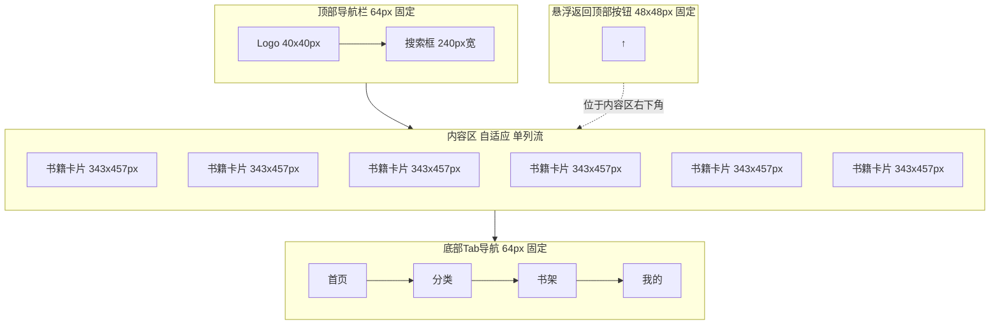

# 移动端首页线框图
## 设计规范
- 基础间距单位：8px
- 圆角：8px
- 主色：深黑 #0D0D12
- 强调色：金色 #F5A623
- 文字色：柔白 #E8E8F0
- 页面宽度：375px（标准移动端宽度）

---

## 区块尺寸规范
| 区块 | 高度 | 边距 | 说明 |
|------|------|------|------|
| 顶部导航栏 | 64px | 左右内边距16px（2单位） | 固定在顶部 |
| 内容区 | 自适应 | 上下边距16px（2单位），左右边距16px（2单位） | 单列卡片流布局 |
| 书籍卡片 | 宽度343px，高度457px（3:4比例） | 卡片上下间距16px（2单位） | 宽度占满内容区 |
| 底部Tab导航 | 64px | 左右内边距24px（3单位） | 固定在底部 |
| 悬浮返回顶部按钮 | 48x48px | 距离底部80px，距离右侧16px | 圆角50%，固定定位 |

---

## Mermaid线框图

---

## 卡片结构规范
每个书籍卡片包含：
1. 封面图：343x457px（3:4比例），圆角8px
2. 书籍标题：18px字重600，上下边距8px（1单位）
3. 作者+评分：14px，评分使用金色强调色，下边距8px（1单位）
4. 简介：13px，最多2行展示，下边距8px（1单位）
5. 价格：16px字重600，强调色展示
