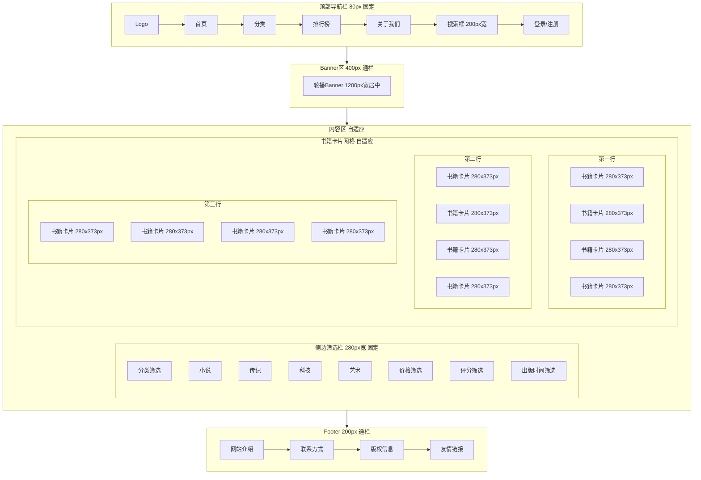

# PC端首页线框图
## 设计规范
- 基础间距单位：8px
- 圆角：8px
- 主色：深黑 #0D0D12
- 强调色：金色 #F5A623
- 文字色：柔白 #E8E8F0
- 页面总宽度：1440px（内容区1200px居中）

---

## 区块尺寸规范
| 区块 | 高度 | 边距 | 说明 |
|------|------|------|------|
| 顶部导航栏 | 80px | 左右内边距24px（3单位） | 固定在顶部 |
| Banner区 | 400px | 上下外边距24px（3单位） | 通栏展示 |
| 内容区 | 自适应 | 上下外边距32px（4单位） | 左侧筛选栏+右侧卡片网格布局 |
| 侧边筛选栏 | 自适应 | 宽度280px，右边距24px（3单位） | 固定定位，随滚动跟随 |
| 书籍卡片 | 宽度280px，高度373px（3:4比例） | 卡片间距16px（2单位） | 网格布局，每行4张 |
| Footer | 200px | 上下内边距32px（4单位） | 通栏展示 |

---

## Mermaid线框图

---

## 卡片结构规范
每个书籍卡片包含：
1. 封面图：280x373px（3:4比例），圆角8px
2. 书籍标题：16px字重600，上下边距8px（1单位）
3. 作者：14px字重400，下边距4px（0.5单位）
4. 评分：14px，金色强调色，下边距8px（1单位）
5. 价格：16px字重600，强调色展示
